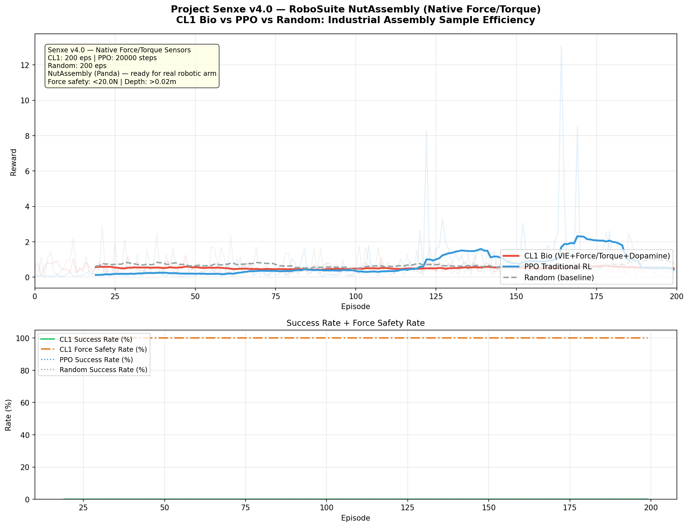

<p align="center">
  <h1 align="center">Project Senxe v4.0</h1>
  <p align="center">
    <strong>Biologically-Grounded Motor Control for Industrial Robotics</strong><br>
    Interfacing Cortical Labs CL1 Biological Neurons with Robotic Arms
  </p>
</p>

<p align="center">
  <a href="#quick-start">Quick Start</a> •
  <a href="#core-philosophy">Core Philosophy</a> •
  <a href="#benchmarks">Benchmarks</a> •
  <a href="#architecture">Architecture</a> •
  <a href="LICENSE">MIT License</a>
</p>

---

> *"What if we stopped training artificial networks to mimic biology — and just used the biology itself?"*

**Project Senxe** is a biologically-grounded control framework that interfaces **Cortical Labs CL1** biological neurons with robotic arms (Franka Panda), benchmarked against PPO and random baselines. v4.0 targets **RoboSuite NutAssembly** with native force/torque sensors — bridging the gap from simulation to real-world industrial assembly.

<p align="center">
  
  <br>
  <em>Left: CL1 Biological Neural Control | Right: PPO Traditional RL — NutAssembly task on Franka Panda</em>
</p>

---

## Core Philosophy

### 1. Free Energy Principle (FEP) as Control Law

Senxe treats the Free Energy Principle not as a theoretical curiosity but as an **actionable control law**. The Physical Disturbance Index (PDI) — computed from velocity and acceleration variance — directly modulates the explore/exploit balance:

- **High PDI** → Unstable state → Increase exploration noise (surprise minimization)
- **Low PDI** → Stable state → Exploit current policy (precision control)

This replaces hand-tuned epsilon-greedy schedules with a principled, biologically-motivated mechanism.

### 2. Neuromorphic Sensorimotor Mapping

The **Virtual Interference Encoding (VIE)** module maps physical sensor readings onto a 64-channel MEA using biologically realistic coding schemes:

| Channel Range | Modality | Coding Strategy | Biological Analog |
|:---:|:---:|:---:|:---:|
| CH 0–15 | Force | Rate coding (burst frequency ∝ force magnitude) | Mechanoreceptor afferents |
| CH 16–31 | Torque / Friction | Traveling wave temporal coding | Proprioceptive spindle fibers |
| CH 32–47 | End-effector Position | Absolute position encoding | Joint angle receptors |
| CH 48–55 | Goal Direction | Directional delta vector | Superior colliculus saccade map |
| CH 56–63 | Insertion Depth | Progress encoding | Depth-sensing cortical neurons |

Force feedback uses **native `robot0_eef_force` and `robot0_eef_torque` sensors** from RoboSuite — no vision proxy needed. This is real tactile feedback suitable for direct sim-to-real transfer.

### 3. Antagonistic Decoding

Motor output follows the biological **flexor/extensor antagonistic** principle:

```
Flexor   CH  0–31  → positive force per action dimension
Extensor CH 32–63  → negative force per action dimension

Action[i] = (flexor_count − extensor_count) / (total + ε)
```

The differential signal is smoothed via EMA (exponential moving average) to produce muscle-like continuous motion, then scaled to the robot's action space. The decoder **automatically adapts** to arbitrary action dimensions (4D for Fetch, 7D for Panda).

---

## Quick Start

### v4.0 — RoboSuite NutAssembly (Recommended)

```bash
# Clone and install
git clone https://github.com/your-username/project-senxe.git
cd project-senxe
pip install -r requirements.txt

# Set MuJoCo renderer (macOS)
export MUJOCO_GL=glfw

# Run the benchmark
python senxe_demo_robosuite.py
```

### Switch to Real CL1 Hardware

The codebase ships with a built-in CL1 simulator. To connect to real Cortical Labs hardware:

```bash
pip install cl-sdk
python senxe_demo_robosuite.py
# Auto-detects cl-sdk at import — zero code changes needed.
```

### v3.0 — FetchPickAndPlace (Legacy)

```bash
python senxe_demo.py
```

---

## Benchmarks

### Key Success Metrics

| Metric | Definition | Why It Matters |
|:---:|:---|:---|
| **Sample Efficiency** | Reward accumulated per episode across CL1 / PPO / Random | Biological neurons learn useful motor policies with orders-of-magnitude fewer samples than PPO |
| **Force Safety Rate (FSR)** | % of episodes where peak force stays below 20 N | Critical for real-world deployment — a policy that completes the task but damages the workpiece is useless |
| **Success Rate** | % of episodes achieving insertion depth > 0.02 m AND force < 20 N | Dual criterion: task completion AND safety |

### v4.0 Configuration

```python
ENV_NAME        = "NutAssembly"
ROBOT           = "Panda"
CL1_EPISODES    = 200       # Biological agent training episodes
CL1_MAX_STEPS   = 200       # Steps per episode
PPO_TIMESTEPS   = 20_000    # PPO total training steps
RANDOM_EPISODES = 200       # Random baseline episodes
INSERTION_DEPTH_THRESHOLD = 0.02   # meters
FORCE_SAFETY_THRESHOLD    = 20.0   # Newtons
```

### Output Artifacts

| File | Description |
|:---:|:---|
| `cl1_nutassembly.mp4` | CL1 bio-agent — last 80 mature episodes with force/torque HUD overlay |
| `side_by_side_nutassembly.mp4` | Synchronized CL1 vs PPO side-by-side comparison |
| `learning_curve_nutassembly.png` | Sample efficiency + Success Rate + Force Safety Rate |

<p align="center">
  
  <br>
  <em>Sample Efficiency: CL1 Bio-Computer vs PPO vs Random on NutAssembly</em>
</p>

---

## Architecture

### Project Structure

```
project-senxe/
├── senxe_demo_robosuite.py    # v4.0 Main: RoboSuite NutAssembly (native F/T sensors)
├── senxe_demo.py              # v3.0 Legacy: FetchPickAndPlace (visual encoding)
├── core/
│   ├── __init__.py            # Unified module exports
│   ├── neurons.py             # CL1 neural interface (mock + real cl-sdk auto-detect)
│   ├── decoder.py             # Antagonistic motor decoding (flexor/extensor)
│   ├── pdi.py                 # Physical Disturbance Index (FEP explore/exploit)
│   ├── curiosity.py           # Neural intrinsic curiosity (firing-pattern novelty)
│   └── video.py               # Video generation utilities
├── tests/
│   ├── __init__.py
│   └── test_core.py           # Unit tests for all core modules
├── plans/
│   └── senxe_v4_robosuite_plan.md
├── requirements.txt
├── LICENSE
└── README.md
```

### Biological Control Pipeline

```
┌─────────────────────────────────────────────────────────────────┐
│                    SENXE CONTROL LOOP                            │
│                                                                 │
│  ┌──────────┐    ┌─────────┐    ┌──────────────┐    ┌────────┐ │
│  │ RoboSuite│───▶│   VIE   │───▶│  64-ch MEA   │───▶│Antagon.│ │
│  │  Sensors │    │ Encoder │    │  (CL1/Mock)  │    │Decoder │ │
│  │ F/T, Pos │    │         │    │              │    │        │ │
│  └──────────┘    └─────────┘    └──────┬───────┘    └───┬────┘ │
│       ▲                                │                │      │
│       │                          ┌─────▼─────┐    ┌─────▼────┐ │
│       │                          │ Dopamine / │    │  Action  │ │
│       └──────────────────────────│ Punishment │◀───│  Output  │ │
│              (env.step)          │ Injection  │    │ (7D OSC) │ │
│                                  └─────┬─────┘    └──────────┘ │
│                                        │                       │
│                                  ┌─────▼─────┐                 │
│                                  │    PDI     │                 │
│                                  │ (FEP Gate) │                 │
│                                  └───────────┘                  │
└─────────────────────────────────────────────────────────────────┘
```

### Core Components

| Component | Module | Biological Basis |
|:---|:---|:---|
| **VIE Encoding** | `senxe_demo_robosuite.py` | Maps force → rate coding, torque → traveling waves (mechanoreceptor-inspired) |
| **Antagonistic Decoder** | `core/decoder.py` | Flexor/extensor differential + EMA smoothing (α-γ motor neuron model) |
| **PDI + FEP** | `core/pdi.py` | Velocity/acceleration variance → explore/exploit (active inference) |
| **Dopamine Injection** | `senxe_demo_robosuite.py` | Positive reward → structured burst on top-K channels (reward prediction error) |
| **Punishment Injection** | `senxe_demo_robosuite.py` | Force violation → random noise on non-top channels (DishBrain unpredictable stim) |
| **Metabolic Guardrail** | `core/neurons.py` | Per-channel health tracking prevents overstimulation (homeostatic regulation) |
| **Channel Calibration** | `core/neurons.py` | 10-second warm-up probes all 64 channels for responsiveness ranking |
| **Intrinsic Curiosity** | `core/curiosity.py` | Firing-pattern novelty detection drives exploration (information-theoretic) |

---

## Tech Stack

| Layer | Technology |
|:---|:---|
| **Robot Simulation** | RoboSuite (NutAssembly, Franka Panda, native F/T sensors) |
| **Physics Engine** | MuJoCo (via Gymnasium for legacy v3.0 FetchPickAndPlace) |
| **Neural Interface** | Cortical Labs cl-sdk (auto-fallback to built-in 64-ch MEA simulator) |
| **RL Baseline** | Stable-Baselines3 (PPO) |
| **Video Pipeline** | imageio + ffmpeg (headless rendering), OpenCV (HUD overlay) |
| **Visualization** | Matplotlib (learning curves) |

---

## Running Tests

```bash
pytest tests/test_core.py -v
```

---

## Author

**Azur (Jiahao)** — 18-year-old independent developer, incoming University of Alberta student.

Built from scratch as an exploration into biological computation and neural motor control for industrial robotics. This project represents a first-principles approach to neuromorphic engineering: rather than training artificial networks to approximate biological dynamics, Senxe interfaces directly with biological neural tissue to solve real-world motor control problems.

---

Copyright © 2026 Azur (Jiahao). All rights reserved.
